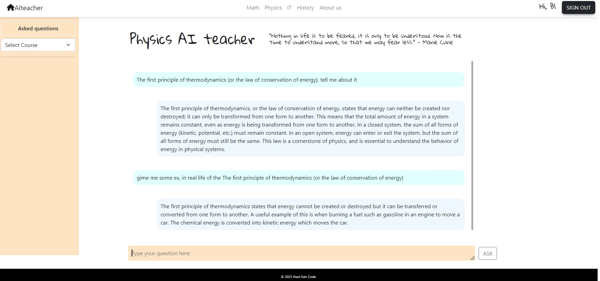
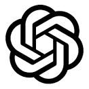

# Ai-Teacher
## Experience personalized learning at its finest with our AI-powered teacher!

### Description
Our web application harnesses the power of AI to provide a unique and effective approach to learning. With our revolutionary AI technology, you can solve your homework problems with ease and boost your academic success. Whether you're a student struggling with homework or an educator looking to incorporate AI technology, our AI teacher has everything you need.

### Features
 * AI-powered teacher to help with homework problems 
 * Personalized learning experience 
 * Cutting-edge technology for academic success 
 * Multiple subject coverage, from physics to history 
 * User-friendly interface
 * DB-storage, external DB attached

### Getting Started
1.  Clone the repository
2.  Install the required dependencies using npm install
3.  Start the server using npm start

### Usage
- Navigate to the home page
- Enter your question or prompt in the chat box
- Our AI teacher will provide a response to your question
- Engage with the AI teacher to further explore the topic

### Note: 
    In order to use this application, users will need a valid API key from OpenAI. 
    Please visit the OpenAI website to obtain an API key. 
    Once you have an API key, please replace the apiKey variable in each CourseAiController with your API key for the application to work properly.
    You have 4 controllers : History/Math/It/Physics
### Dockerization
This application has been dockerized and can be easily started using Docker Compose. Follow the steps below to start the containers:

1.  Ensure that you have Docker and Docker Compose installed on your machine 
2. Clone the repository 
3. Navigate to the project root directory in your terminal 
4. Run " docker-compose up --build " to build and start the containers 
5. Access the application at http://localhost:<CLIENT_PORT>

Note that the <CLIENT_PORT> value is specified in the docker-compose.yml file and defaults to 3000. You can modify this value in the docker-compose.yml file as needed.

### Technologies Used
 - React
 - JAVA
 - PostgreSQl
 - Open Ai
 - Spring

### Contributors
 * ROSU NICOLAE 
 * PRISCILA RADOI

### License
This project is licensed under the MIT License.
